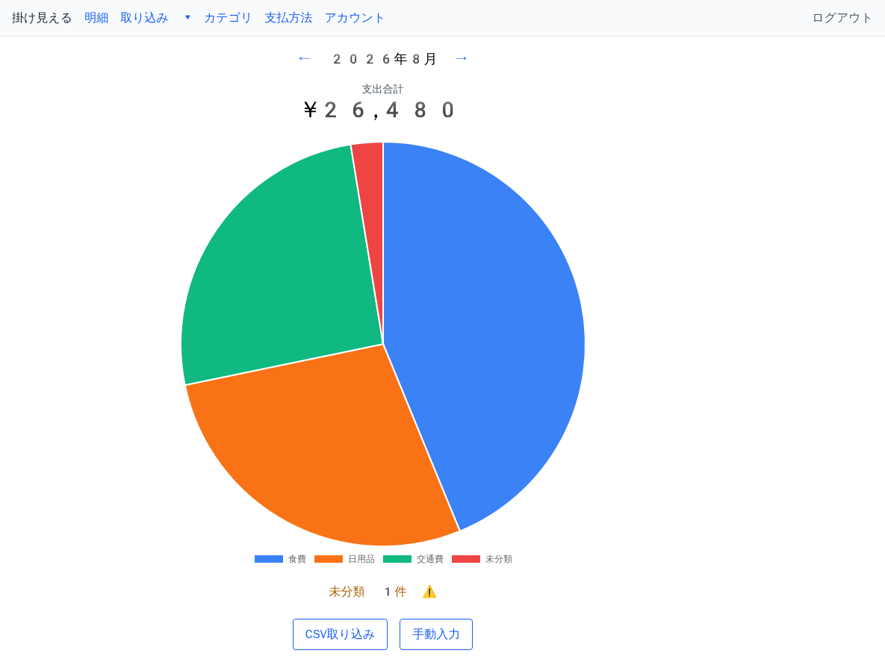
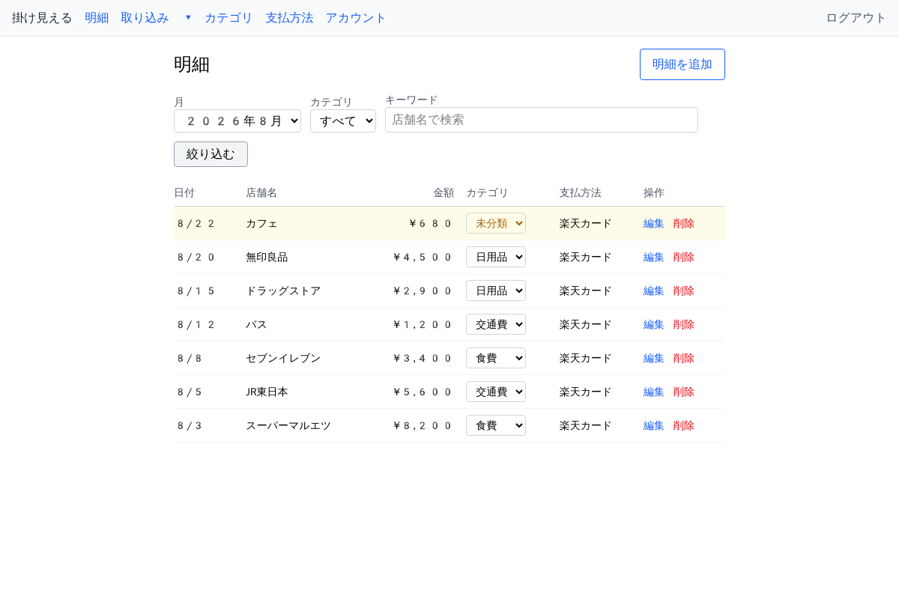

# KakeMieru（家計見える）

クレジットカード明細 CSV をアップロードして収支をグラフで可視化する家計簿 Web アプリ。

## スクリーンショット

| ダッシュボード | 明細一覧・絞り込み |
|---|---|
|  |  |

月次の支出合計とカテゴリ別の内訳を円グラフで表示し、明細は月・カテゴリ・キーワードで絞り込める。カテゴリはその場で（ページ遷移なしに）変更・削除できる。

## 技術スタック

| 領域 | 採用技術 |
|---|---|
| 言語・フレームワーク | Ruby / Rails 8 |
| データベース | PostgreSQL |
| フロントエンド | Hotwire（Turbo / Stimulus）+ importmap（Node 不要） |
| CSS | Tailwind CSS（`tailwindcss-rails`・スタンドアロンバイナリ） |
| グラフ | Chart.js（`vendor/javascript` に自己完結バンドルを同梱） |
| 認証 | Rails 8 Built-in Authentication（メール + パスワード） |
| メール送信 | Resend（本番）/ letter_opener（開発） |
| テスト | RSpec + FactoryBot + Shoulda Matchers / Capybara + Cuprite（E2E） |
| 実行環境 | Docker Compose（開発）/ Fly.io（本番・東京 nrt） |
| CI/CD | GitHub Actions（lint / brakeman / test / Fly デプロイ） |

主要な設計判断は [docs/decisions/](docs/decisions/)（ADR）に記録している。

## 前提条件

- Docker / Docker Compose v2（ローカルに Ruby/Rails は不要）

## セットアップ・起動

```bash
# クローン
git clone https://github.com/westtail/kakemieru.git
cd kakemieru

# 環境変数（POSTGRES_PASSWORD を設定）
cp .env.example .env

# ビルド
docker compose build

# 起動（web / db / chrome が立ち上がる）
docker compose up -d

# DB 準備（初回のみ・作成 + マイグレーション）
docker compose exec web bin/rails db:prepare
```

ブラウザで http://localhost:3000 を開く（未ログインは `/sign_in` にリダイレクト）。
`/sign_up` からアカウント登録すると、そのままログインしてダッシュボードに入れる。

### 主な画面（認証）

| パス | 内容 |
|---|---|
| `/sign_up` | ユーザー登録 |
| `/sign_in` | ログイン |
| `/sign_out` | ログアウト（DELETE） |
| `/passwords/new` | パスワードリセット申請 |
| `/account` | アカウント設定（メール・パスワード変更） |
| `/account/delete` | 退会 |

## テスト

テストは Docker コンテナ内で実行する（`chrome` サービスが起動している必要がある = `docker compose up -d` 済み）。

```bash
# 全テスト（ユニット / リクエスト / システム(E2E)）
docker compose exec web bundle exec rspec

# 種別ごと
docker compose exec web bundle exec rspec spec/models       # モデル（ユニット）
docker compose exec web bundle exec rspec spec/services      # サービス（CSVパーサ・取り込み等）
docker compose exec web bundle exec rspec spec/requests      # コントローラ（リクエスト）
docker compose exec web bundle exec rspec spec/features       # E2E（実ブラウザ・要 chrome）

# 1ファイルだけ / 1テストだけ実行（行番号指定）
docker compose exec web bundle exec rspec spec/requests/transactions_spec.rb
docker compose exec web bundle exec rspec spec/requests/transactions_spec.rb:88

# ドキュメント形式で詳細表示
docker compose exec web bundle exec rspec --format documentation
```

- カバレッジは実行のたび `coverage/index.html` に出力される（目標 80%。下回ると警告）。
- Lint: `docker compose exec web bin/rubocop`
- セキュリティ静的解析: `docker compose exec web bin/brakeman --no-pager`

### E2E（システムスペック）について

`spec/features/` は Capybara + Cuprite で別コンテナの Chrome（`docker compose up -d` で起動）を操作する。追加設定は不要。詳細は [ADR-0023](docs/decisions/0023-e2e-test-environment.md) を参照。

主要なユーザーフローがブラウザで実際に通ることをスモーク的に検証する（サインアップ / ログイン・ログアウト / パスワード再設定 / 退会 / 取り込みドロップダウン / CSV 取り込み など）。細かい分岐は request spec 側で網羅し、E2E は代表的なハッピーパスに絞っている。

```bash
# E2E だけ実行
docker compose exec web bundle exec rspec spec/features
```

## 開発の便利機能

- **送信メールの確認**: 開発環境ではメール（パスワードリセット等）が実送信されず、
  http://localhost:3000/letter_opener で内容を確認できる（letter_opener_web）。
- **Rails コンソール**: `docker compose exec web bin/rails console`

## 停止

```bash
docker compose down
```

## デプロイ

本番は Fly.io（東京 nrt）。デプロイは **`main` ブランチへの push で自動実行**される。

- 開発は `develop` で行い、リリース時に `develop` → `main` を PR でマージする。
- `main` への push を [.github/workflows/fly-deploy.yml](.github/workflows/fly-deploy.yml) が検知し、`flyctl deploy --remote-only` を実行する。
- DB マイグレーションはデプロイ時に `bin/docker-entrypoint` の `db:prepare` で自動適用される。

手動デプロイや Fly の操作は [docs/infra/FLYCTL.md](docs/infra/FLYCTL.md)、パイプライン全体は [docs/infra/CI_CD.md](docs/infra/CI_CD.md) を参照。

## ドキュメント

- [docs/PROJECT_ABOUT.md](docs/PROJECT_ABOUT.md) — 全体像・技術スタック・要件
- [docs/DEVELOPMENT_GUIDE.md](docs/DEVELOPMENT_GUIDE.md) — 開発フロー
- [docs/design/](docs/design/) — DB / 画面 / 認証などの設計
- [docs/decisions/](docs/decisions/) — ADR（意思決定記録）

### 主要な設計判断（ADR 抜粋）

- [0010 テストフレームワーク](docs/decisions/0010-testing-framework.md) — RSpec 採用
- [0011 認証方式](docs/decisions/0011-authentication-strategy.md) — Rails 8 Built-in Authentication
- [0012 CSV 取り込み方式](docs/decisions/0012-csv-import-strategy.md)
- [0013 DB モデル設計](docs/decisions/0013-database-model-design.md)
- [0023 E2E テスト環境](docs/decisions/0023-e2e-test-environment.md) — Capybara + Cuprite
- [0030 Tailwind CSS 採用](docs/decisions/0030-tailwind-css-adoption.md)

## 本番インフラのセットアップ

Fly.io・GitHub Actions・ブランチ保護などの初回設定は [docs/infra/INITIAL_SETUP.md](docs/infra/INITIAL_SETUP.md) を参照。
